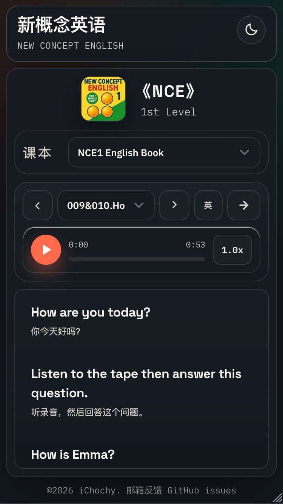

# 新概念英语 · 全四册在线点读系统

[](https://github.com/ichochy/nce/stargazers)
[](https://github.com/ichochy/nce/blob/main/LICENSE)
[](http://nce.ichochy.com)

**《New Concept English》** 全四册在线课文朗读、**单句点读**、中英对照，随时随地自学英语！

---

### ✨ 主要功能

- 🎧 **美音课文朗读**：流畅自然的原版音频
- 📍 **单句点读**：点击任意句子即可跟读练习
- 🔁 **单句循环增强**：可设置循环次数（无限 / 2 / 3 / 5 / 10 次）与循环间隔时间（0 / 0.5 / 1 / 2 / 3 秒）
  - **单句循环**：每句按设定次数循环后自动进入下一句，整课逐句循环
  - **单句点读**：设定次数后点击句子按次数+间隔重复播放，播完停在句首；未设定次数则保持点读一遍的原行为
- 📖 **中英对照**：逐句显示中英文，便于理解
- 🔠 **歌词字号调节**：控制栏字号按钮循环切换 5 档字号（小 / 标准 / 大 / 特大 / 最大），设置持久化
- 📱 **响应式设计**：手机、平板、电脑均可流畅使用
- 🚀 **无需安装**：浏览器直接访问，随时学习

**在线体验**：👉 **[http://nce.ichochy.com](http://nce.ichochy.com)**

---

### 📸 截图




### 📚 四册学习指南

#### 📕 第一册：《First Things First》
**目标**：打好语音与基础  
**课数**：144课 | **词汇量**：约 600 词  
适合 **零基础** 学习者，建立语感和正确发音。

#### 📘 第二册：《Practice and Progress》
**目标**：语法体系与听说读写同步提升  
**课数**：96课 | **词汇量**：约 1500 词  
适合有基础的学习者，系统梳理语法。

#### 📙 第三册：《Developing Skills》
**目标**：进阶阅读与复杂句型  
**课数**：60课 | **词汇量**：约 2500 词  
适合想提高综合能力、阅读原版材料的学习者。

#### 📗 第四册：《Fluency in English》
**目标**：接近流利表达与学术阅读  
**课数**：48课 | **词汇量**：约 3500–4000 词  
适合高阶学习者、考研/雅思/托福备考。

**推荐学习路径**：按册顺序学习 → 第一册打基础 → 第四册冲刺流利。

---

### 🛠️ 技术与资源

- **前端**：HTML + CSS + JavaScript（纯静态实现）
- **音频来源**：美音音频来自 [tangx/New-Concept-English](https://github.com/tangx/New-Concept-English)
- **中文字幕**：由 Gemini AI 生成（已尽力优化，但可能存在少量错误，欢迎大家指正与贡献）
- **翻译脚本**：作者自研 Python 工具 [iGSTT](https://ichochy.com/posts/shell/20251015.html)

---


## 📦 外挂资源

系统的核心设计：**播放器与资源完全解耦**。一份学习资源就是一个可静态托管的目录，包含 `book.json` 描述文件、每课的 MP3 音频与 LRC 歌词。

### 目录结构

```
your-book/
├── book.json          # 课本描述文件（必需）
├── cover.png          # 课本封面（可选）
├── unit1.mp3          # 课文音频
├── unit1.lrc          # 课文歌词（中英对照）
├── unit2.mp3
└── unit2.lrc
```

### book.json

```json
{
  "name": "新概念英语",
  "level": "1 st",
  "cover": "cover.png",
  "units": [
    { "title": "Unit 1 Hello", "filename": "unit1" },
    { "title": "Unit 2 Nice to meet you", "filename": "unit2" }
  ]
}
```

系统按 `${bookPath}/${filename}.mp3` 与 `${bookPath}/${filename}.lrc` 拼接资源地址。

### LRC 歌词格式

标准 LRC 时间标签，`|` 分隔英文与中文：

```
[00:12.34]Good morning, class. | 早上好，同学们。
[00:15.00]Stand up, please. | 请起立。
[00:18.50]Sit down, please. | 请坐。
```

- 时间标签支持 `[mm:ss.xx]` 或 `[mm:ss.xxx]`
- `|` 左侧为英文、右侧为中文（中文可省略）
- `#` 开头的行视为注释，空行自动忽略

### 接入自己的资源

1. **准备资源**：按上述结构生成 `book.json`、MP3 与 LRC 文件，托管到任意支持 CORS 的静态服务器（GitHub Pages、Vercel、OSS、Nginx 等）
2. **注册课本**：在 `data.json` 的 `books` 数组中添加一条记录：

   ```json
   {
     "key": "MYBOOK",
     "title": "My English Book",
     "path": "https://your-domain.com/your-book"
   }
   ```

3. **访问**：部署播放器后，通过 `https://your-player.com/#MYBOOK` 直达该课本

> ⚠️ 资源服务器需返回 CORS 头（如 `Access-Control-Allow-Origin: *`），否则浏览器会拦截跨域请求 `book.json` 与 LRC 文件。


---

### ⚠️ 说明与版权

- 本项目**仅供个人学习研究使用**，非商业用途。
- 所有内容来源于互联网，我们不拥有版权。
- 如有侵权，请联系 [me@ichochy.com](mailto:me@ichochy.com) 及时处理。
- **强烈建议**支持正版，购买官方教材与音频。

---

### 🤝 如何贡献

欢迎大家一起完善这个项目！

- 提交 Issue 反馈翻译错误、功能建议
- Pull Request 改进代码、修正字幕、添加新功能
- 分享给更多英语学习者

---

## ☕ 支持与打赏
如果这个项目或内容曾对您有所帮助，欢迎给予一点支持：
- ⭐ **点一个 Star，鼓励项目持续维护**
- ☕ **请我喝杯咖啡，或打赏一点生命值（可选）**


感谢每一位使用、关注、反馈和支持我的朋友。  
每一个 **Star** 和鼓励，都是我继续坚持下去的动力 ❤️  

我是一个 80 后程序员，目前正在与白血病（CMML）抗争。  
继续维护项目、分享技术，希望这些内容能够持续帮助更多朋友。  

感谢您的认可与善意，祝您一切顺利！  

---

**Keep learning — progress comes with persistence.**  
**坚持学习，每一天都有进步。**

---

**作者**：iChochy  
**Blog**：https://ichochy.com  
**Email**：me@ichochy.com  
**GitHub**：https://github.com/ichochy/nce
